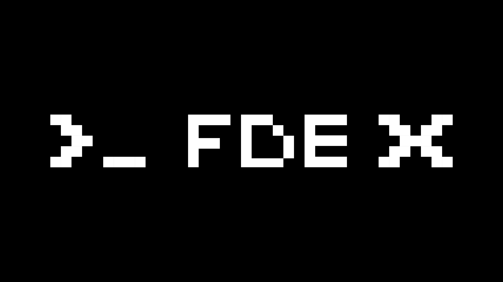

# FDE-X-Skills

**English** | [简体中文](README.zh.md)

> **FDE, Forward Deployed Engineer**   Understands AI, and goes beyond it into real business scenarios; understands why a problem happens, and turns AI into reusable, deliverable results.

FDE-X Skill is an enterprise-grade skill repository open-sourced by the [FDE-X community](https://fde-x.com), following the [Agent Skills](https://agentskills.io/specification) open standard.

## Skill Catalog

**Every skill comes from a real enterprise need, and is used and validated in real enterprise settings**. 

<!-- SKILLS:START -->
_Skills distilled from real enterprise tasks are listed here. Contributions are welcome — start from a real enterprise need_
<!-- SKILLS:END -->

## Enterprise Needs

> Bring a real problem in

If you have a real enterprise scenario or a pain point in landing AI, describe it through the [enterprise demand form](.github/ISSUE_TEMPLATE/enterprise-demand.yml) or [enterprise co-creation](https://fde-x.com/#enterprise).

## Open Source Contribution

> Be someone who solves the problem with us

Read the [contribution guide](CONTRIBUTING.md), link your work to a need, and propose a solution.

## FDE-X Community

- **If you are deeply interested in AI** Join the community. There are top-tier roles and real work you can talk about in interviews — your results go directly to the business owners who set the problem
- **If you have deep experience landing AI and a distinct understanding of AI application scenarios** Join the mentor group. More than 30 mentors have joined: 10+ HRDs from publicly listed tech companies, 20+ AI algorithm and FDE leads from major tech firms, plus investors and entrepreneurs
- **If you have deep technical expertise in AI** Become a technology partner. We have members from the AI labs at Fudan University, Shanghai Jiao Tong University, and the Gaoling School of Artificial Intelligence at Renmin University of China, as well as the DeepSeek AI and Shanda AI teams

Follow the FDE-X official WeChat account and leave us a message there, or add WeChat 「AnyHelper_FDE」 to get in touch.

## About Us
- **Founding members** From DeepSeek, Tencent Hunyuan, Doubao, Zhipu, and ByteDance, plus leading teams and universities such as Shanghai Jiao Tong University, Fudan University, Peking University, Tianjin University, and Carnegie Mellon University
- **Mentors** Professors and experts who understand AI, HR leads at publicly listed tech companies who understand hiring, and investors who understand startups
- **Technical review committee and partners** AI labs at Fudan University, Shanghai Jiao Tong University, and the Gaoling School of Artificial Intelligence at Renmin University of China, plus the DeepSeek AI and Shanda AI teams

## Documentation

- [From Enterprise Needs to Skills](docs/从企业需求到Skill.md) (Chinese): demand intake, task practice, and the distillation process
- [Skill Structure and Verification](docs/Skill结构与验证.md) (Chinese): skill structure, quality checks, and maturity assessment

## License

[MIT](LICENSE).
