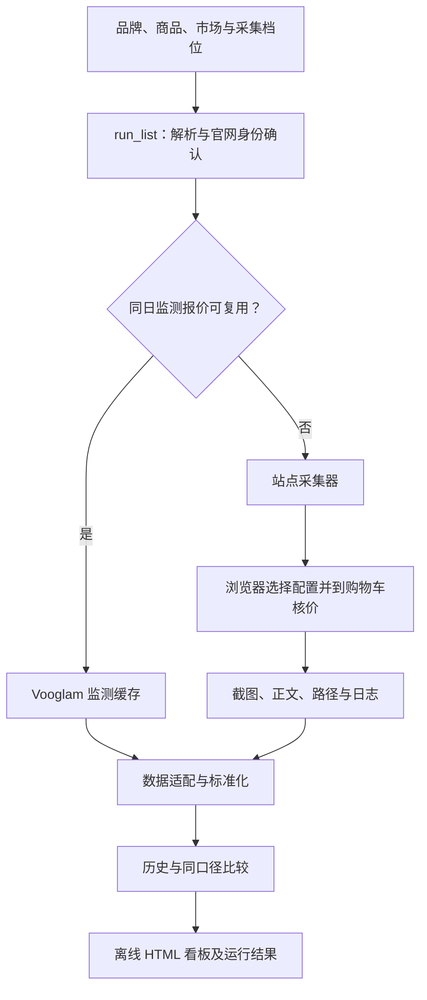

# 系统架构

本文说明当前实现的数据流与实际产物。入口规则见 [`SKILL.md`](../../SKILL.md)；这里的字段以本仓库已生成的 `normalized_dataset.json` 为准。

## 总体数据流



自然语言由 Skill 整理成请求；实际名单入口是 `scripts/skill/run_list.py`。它接受“品牌 - 商品名”文本或 JSON，校验品牌／市场，使用已确认目录或用户提供的官网 URL 解析商品，规划 `classic`、`medium`、`full` 档位，判断 Vooglam 同日缓存是否可用，再分别调用站点采集与看板程序。新商品没有唯一官网链接时写 `clarification.json`，不进入采集。

## 站点执行

**Vooglam** 使用美国站已核验商品、默认配色和固定零度 Single Vision 场景。采集器沿当前支持的镜片树选择技术和材料，进入购物车读取商品行的镜框、镜片和小计，保存商品与路径证据。监测库可对满足同商品、同口径、同日及所选档位覆盖要求的记录复用；`--force-refresh` 跳过复用。

**Firmoo** 分别核对 US 与 UK 官方商品 URL、型号和对应配色，在 Non-Prescription 流程中按档位选择实际可见路径，到购物车核价并保存页面与截图。当前没有同日监测缓存。两个站点的选择器、路径和错误恢复保持独立实现；统一的是上层请求及下游规范化数据，并非一个已经完成的通用站点 Adapter 框架。

## 规范化数据集

生成的 `normalized_dataset.json` 顶层为：

```text
dataset
├── records
├── evidence
├── coverage
├── errors
└── quality_flags
```

`records` 是数组，以 `entity_type` 区分实体。当前产物可见 `product`、`variant`、`lens_configuration`、`price_observation`，在有外部线索时也可能有 `channel_observation`。常见公共字段包括 `run_id`、`brand`、`market`、`currency`、`status`、`source_kind`、`observed_at`、`source_url_or_ref`、`evidence_id`；字段缺失或空值必须按该来源的实际含义解释。

| 记录 | 主要字段与用途 |
| --- | --- |
| `product` | `product_id`、`name`、`product_url`、`product_type`、`scope`：确认被观察的官网商品 |
| `variant` | `variant_id`、`source_sku`、`color`、`size`、`availability` 及各字段状态：区分配色或 SKU |
| `lens_configuration` | `lens_config_id`、`vision_type`、`selection_path`、`lens_path`、`technology`、`material`、`refractive_index`：保留实际配置语义 |
| `price_observation` | `product_id`、`variant_id`、`lens_config_id`、`base_frame_price`、`lens_surcharge`、`quoted_subtotal`、`price_basis`、`currency`、`observed_at`：一条有上下文的报价观测 |

`evidence` 是数组，实际字段包括 `evidence_id`、`source_url_or_ref`、`source_type`、`captured_at`、`scope`、`snapshot_ref`、`snapshot_exists`、`access_status`；部分导出还有 `snapshot_local`。记录通过 `evidence_id` 关联证据。HTML 能显示来源信息，但离线核验仍需保留引用的截图／正文文件。

`coverage` 在当前数据集中是**对象**，含 `sources` 列表及总 `completeness`。来源项可包含 `requested_scope`、`observed_scope`、`success_count`、`missing_count`、`completeness`、`history_dates`；增量采集信息可放在 `incremental`。`missing_count` 可能为 `null`，不能当作零。`errors` 是错误数组；`quality_flags` 是质量标记数组，至少包含 `code`，也可能包含行号、来源或详情。错误和质量标记应随报告保留，不能因看板已生成而忽略。

## 历史、比较与状态

Vooglam 监测历史保存在 `scripts/monitoring/history.sqlite3`，观测有实际时间，不回填未采集日期。同日复用要满足已核价和证据完整等条件；`full` 不用固定监测清单冒充全路径覆盖。看板只在同商品、SKU／配色、处方、镜片路径、技术、材料、市场、币种与报价口径一致时比较历史；不满足条件时保留观测但不计算变化。

名单运行结果写入 `run_result.json`：零条已核验报价为 `failed`；有报价但某步骤失败为 `partial`；所需采集或复用步骤成功为 `completed`。另外需要检查 `verified_prices`、`steps`、覆盖与错误；状态本身不代表配置全覆盖。

## 主要输出

```text
run-output/
├── resolved_request.json
├── run_result.json
├── *.log
├── vooglam/                 # 涉及 Vooglam 时
├── firmoo/                  # 涉及 Firmoo 时
├── external_bundle.json
└── dashboard/
    ├── index.html
    └── normalized_dataset.json
```

目录随本次品牌、成功步骤和运行方式变化。`--dry-run` 只输出解析与环境检查结果，不创建该目录；正式运行要求输出目录尚不存在。完整的运行命令与异常处理以 [`SKILL.md`](../../SKILL.md) 为准。
