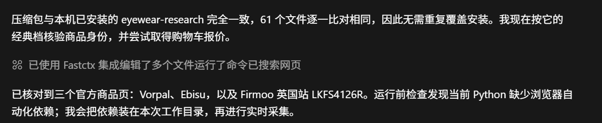
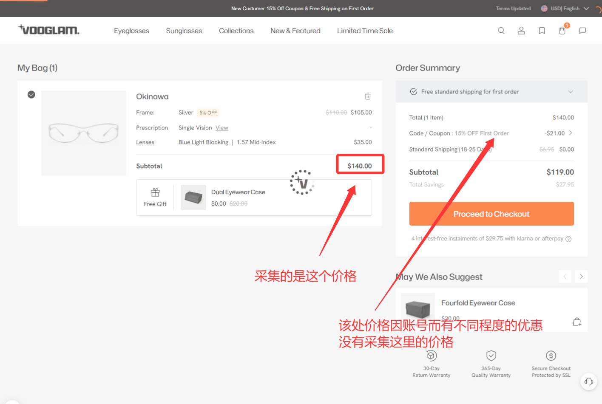
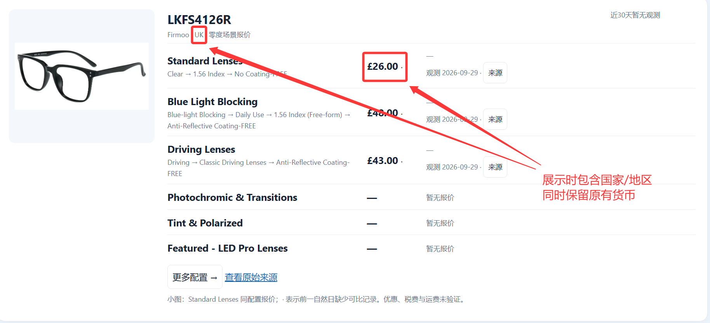
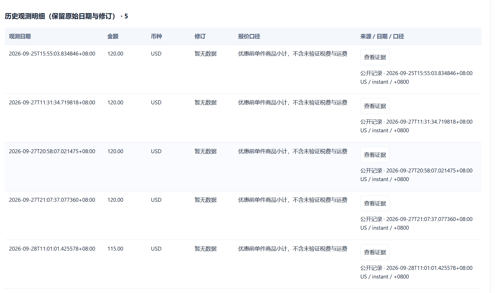
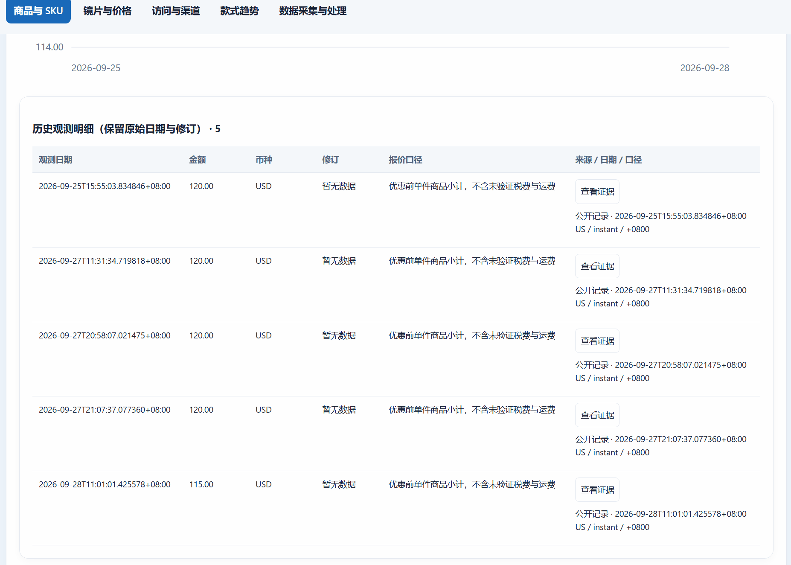
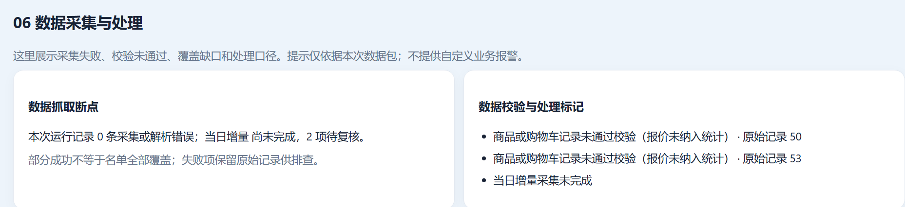
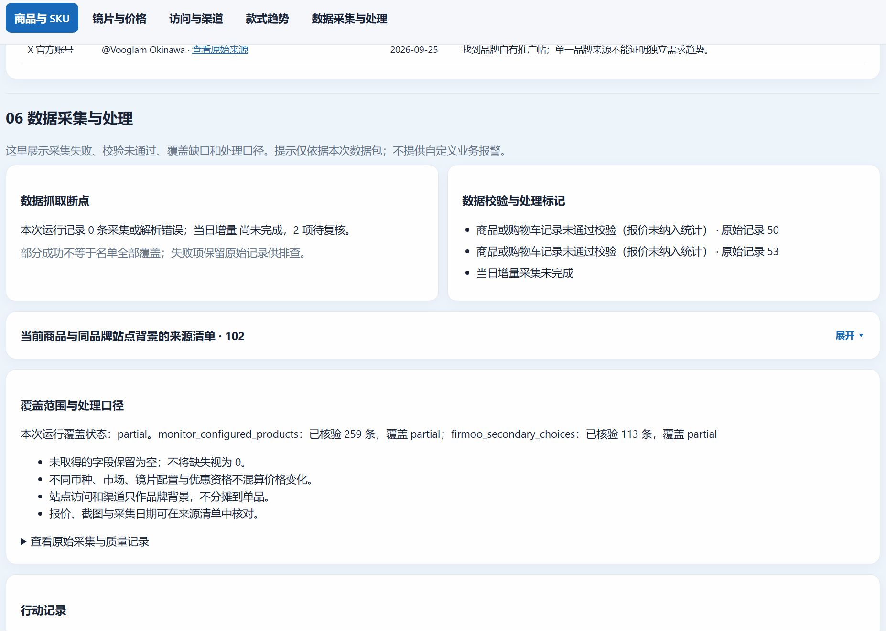

# 关键设计决策

本文把[企业案例](enterprise-case-study.md)中的需求判断转成可检查的工程取舍，说明背景、决定与代价。

# 1. 关键设计一：先定义商品身份，核验的对象，可比性等数据边界

项目中主要明确了四类数据边界。

## 1.1 商品身份

系统输入是：

> 品牌 + 商品名

对于已经确认的商品，系统保存官方商品链接。

如果出现新商品，可以先通过搜索获得候选结果，再进一步确认官方页面。

## 1.2 配镜价格

眼镜行业的特殊性在于：

> 镜框价格并不等于最终配镜价格。

用户可能继续选择诸如Single Visioin,Reading等配置，以及不同的材质，折光率，是否防蓝光等特质

因此，不同配置组合可能对应完全不同的最终价格。

在这个项目中，我们采取将完成镜片配置之后**购物车的报价**作为主要依据，如图

##### 如图

## 1.3 价格变化

在眼镜行业中，往往存在主站和地区分站，而由于汇率，地区政策，运费等不同也可能导致最后的报价千差万别。面对诸多的情况，我们选择将“市场，币种”等作为控制变量，只有当他们一致时，才纳入可比较记录

因此：

> **没有可比较记录时，系统宁愿显示“暂无可比较历史”，也不会输出一个没有意义的涨跌百分比。**

# 2. 关键设计二：任何结果都应该能够回到证据

## 2.1可溯源性

所有的竞品看板，最终都要回到最原始的问题上：**如果我有了这些洞察和数据，他能指导我做些什么**

但是在真正的投入真金白银操作之前，操作者往往要确认信息的真实性。

因此看板最重要的就是真实性，而真实性往往来自于可溯源

故本项目为报价保留对应的证据链。

每条对外展示的数据可以关联：

- 商品页面；
- 配镜配置；
- 自动化选择路径；
- 采集时间；
- 购物车结果；
- 截图。

可追溯性不仅方便展示，也直接服务后续调试与数据审核。

#### 本图为单个商品历史采集的溯源记录

#### 动图展示

---
#### 如图为采集失败状态展示

##### 动图展示

