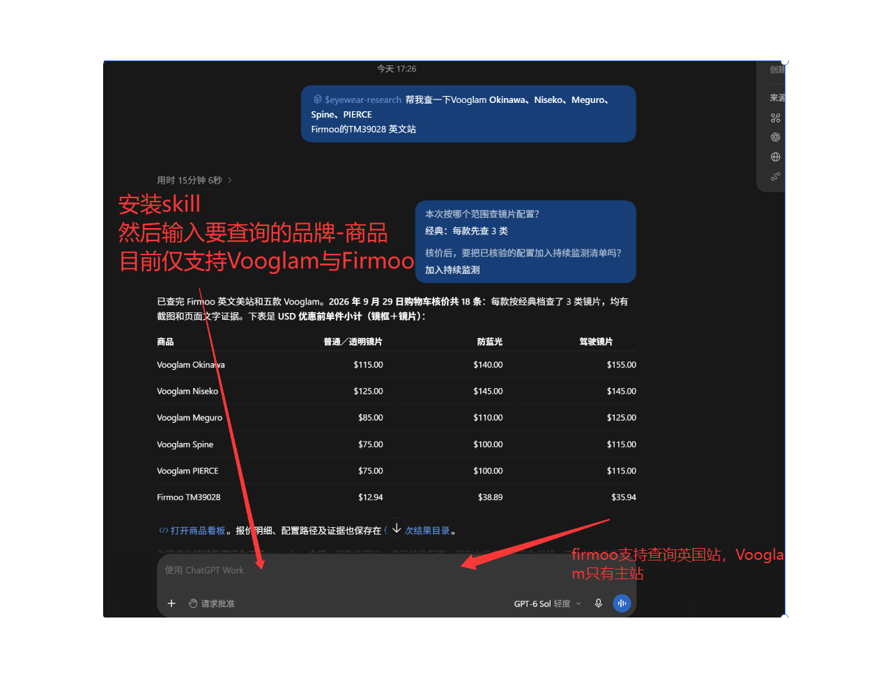
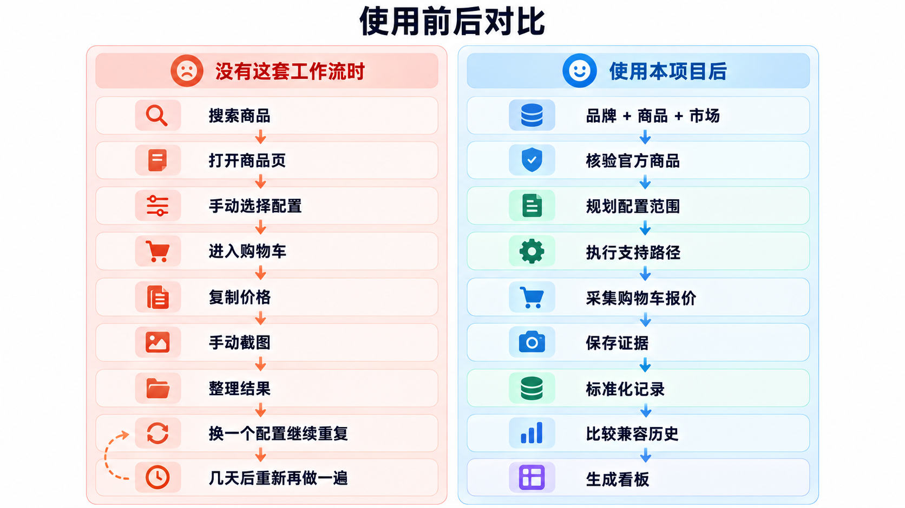

# 可核验的配置型商品报价 Skill

> 面向复杂配置商品的报价采集、核验、历史比较与证据留存。

本项目源于一个真实的跨境配镜企业需求，并进一步抽象为一套适用于**配置型商品报价**的可复用工作流。

对于眼镜、电脑、套餐、保险、汽车配置等商品，最终价格由**商品身份、市场、币种、配置路径和购买流程**共同决定。简单抓取商品页标价，通常不足以支持可靠比较。

本项目通过模拟真实购买路径获取报价，并同步保留商品身份、配置、时间、来源与截图等证据，这使得本项目每一条报价都能够被检查、追溯和复核。

当前版本以**跨境配镜行业**作为首个落地场景，重点支持 **Vooglam** 与 **Firmoo** 的部分市场和配镜流程。

> 核心目标是可靠解决一个更明确的问题：
>
> **如何采集、核验并比较最终价格依赖配置路径的商品报价。**

---

## 1. Demo



一个典型任务可以是：

```text
对AI:"查看 Vooglam 的 Covenant与Spine 顺便帮我看一下Firmoo的S939英国站的报价"
选择：经典、中档或全量采集模式（经典尝试三类常用配置，中档扩展支持配置，全量遍历当前实现支持范围内的所有配置）
等待AI采集完毕，并选择后续是否加入持续监听名单
得到看板
```

系统执行流程：

```text
商品解析
   ↓
配置规划
   ↓
浏览器执行
   ↓
购物车核价
   ↓
证据采集
   ↓
结果校验
   ↓
历史比较
   ↓
HTML 看板
```

---

## 2. 它能做什么

给定品牌、商品名称、目标市场和采集范围后，当前工作流可以：

- 核验目标商品对应的官方页面；
- 根据采集档位规划支持的商品配置路径；
- 使用浏览器自动化模拟真实配置与购买流程；
- 在购物车阶段读取镜框与镜片组合报价；
- 保存商品页、配置过程和购物车截图等证据；
- 将不同站点的数据标准化为统一数据集；
- 区分成功、失败、未覆盖和数据质量问题；
- 在满足同口径条件时比较历史报价；
- 生成可离线查看的 HTML 商品看板。

完整的企业需求演变与范围收敛过程见：

```text
docs/enterprise-case-study.md
```

---

## 3. 为什么需要它

### 3.1 商品页价格不等于最终报价

对于配置型商品，最终价格可能由多个选择共同决定。

以眼镜为例：

```text
镜框
+
处方类型
+
镜片类型
+
材质 / 技术
+
市场
=
最终报价
```

商品页上的镜框价格，并不能直接回答：

> 用户按照某一种镜片配置完成选择后，在购物车中实际看到的报价是多少？

因此，本项目选择执行真实的支持配置路径，并以**购物车商品行报价**作为当前核价依据。

---

### 3.2 一个价格只有带上上下文才可比较

即使两个记录都显示 `$100`，它们也不一定可以直接比较。

至少需要确认：

```text
商品身份
+ SKU / 变体
+ 市场
+ 币种
+ 配置路径
+ 报价口径
+ 时间
```

只有这些关键条件兼容，历史价格比较才有意义。

当没有可比较报价时，系统会明确指出：

```text
no_comparable_history
```

---

### 3.3 每一条报价都应该能够回到证据

所有的竞品看板Skill，最终都要回到最原始的问题上：**如果我有了这些洞察和数据，他能指导我做些什么**

但是在真正的投入真金白银操作之前，操作者往往要确认信息的真实性。

因此看板最重要的就是真实性，而真实性往往来自于可溯源

故本项目为报价保留对应的证据链。

每条对外展示的数据可以关联：

一次有效报价通常可以回到以下的因素，更详细的证据展示，请查看[关键设计决策](docs/design-decisions.md)：

```text
报价
├── 商品身份
├── 来源 URL
├── 市场
├── 配置路径
├── 执行过程
├── 采集时间
├── 购物车结果
├── 截图 / 页面证据
└── 状态
```

---

## 4. 使用前后对比



## 5. 快速开始

### 5.1 环境要求

- Python 3.10+
- Playwright 与 Chromium
- 采集 Firmoo 时，本机还需要安装 Chrome 或 Edge

解压发布包后，在**解压目录**安装依赖：

```powershell
python -m pip install -r scripts/skill/requirements.txt
python -m playwright install chromium
```

### 5.2 准备商品列表
(该操作为直接调用脚本操作 如调用skill直接自然语言输入即可)
在解压目录新建 `products.txt`，每行写一件商品。例如，以下两件商品均在当前包的已确认商品目录中：

```text
Vooglam - Okinawa
Firmoo - S939
```

也可以使用 JSON 请求文件，填写已经核对过的官网商品链接：

```json
{
  "products": [
    {
      "merchant": "Firmoo",
      "product": "S939",
      "market": "US",
      "url": "https://www.firmoo.com/eyeglasses-p-4611.html?color=21101"
    }
  ]
}
```

当前实时采集支持 Vooglam 美国站，以及 Firmoo 美国、英国站。文本名单中的商品如果不在已确认目录内，程序会生成 `clarification.json`，要求确认官网商品链接；它不会直接把搜索结果当作目标商品。提供链接后，采集器仍会核对实际商品身份。

### 5.3 建议先运行 Dry Run

进入解压目录的 `scripts/`：

```powershell
cd scripts
```

先解析名单并检查运行环境：

```powershell
python -m skill.run_list --input ../products.txt --output ../run-output --dry-run
```

命令会输出解析后的商品、当天可复用的报价、待采集商品、缓存提示和环境问题，分别对应 `products`、`reused_today`、`needs_collection`、`cache_warnings` 和 `runtime_issues`。Dry Run 不会联网采集或核价，也不会创建 `run-output` 目录。如有环境问题，先按 `runtime_issues` 的提示处理。

### 5.4 执行正式采集

确认 Dry Run 结果后，运行经典档：

```powershell
python -m skill.run_list --input ../products.txt --output ../run-output --tier classic
```

`--tier` 支持 `classic`、`medium` 和 `full`，默认值为 `classic`。classic只采集最常用的三种配置，即普通透明镜片，防蓝光镜片，防蓝光镜片。medium会尝试覆盖更多配置。`full` 表示对所有的配置进行遍历。

正式运行要求 `--output` 指向**尚不存在的目录**，以免覆盖已有证据。若要再次运行，请更换输出目录名称。程序可能复用当天已有、且覆盖所选档位的 Vooglam 监测报价；需要重新采集时可加 `--force-refresh`。

### 5.5 查看结果

采集结束后，从解压目录打开：

```text
run-output/dashboard/index.html
```

输出目录还包含 `run_result.json`、各步骤日志、结构化数据及已取得的证据文件。`run_result.json` 会记录最终状态、已核验报价数量和步骤结果。

`completed` 表示所需采集或复用步骤成功；`partial` 表示已有报价，但仍有步骤失败；没有取得购物车核价时为 `failed`。部分配置未能采集时，应结合日志和看板中的覆盖情况查看，不能把商品页标价当作已核验的购物车报价。

## 6. 当前支持范围

### Vooglam

当前重点支持：

- 美国站 / USD；
- 常规眼镜（不含sunglass）；

### Firmoo

当前重点支持：

- 美国站 / USD；
- 英国站 / GBP；
- 常规眼镜（不含sunglass）

## 7. Evaluation

当前正式 Benchmark 仍在整理中。

截至 2026 年 10 月 6 日，本地测试产物中已有 9 款不同商品取得购物车核价，覆盖 Vooglam 美国站、Firmoo 美国站和英国站。其中 5 款 Vooglam 商品进入持续监测；最长连续报价记录为 10 个自然日（2026 年 9 月 27 日至 10 月 6 日）。

---

## 8. 文档导航

| 文档 | 作用 |
|---|---|
| `docs/enterprise-case-study.md` | 真实企业需求如何一步步收敛为当前交付 |
| `docs/architecture.md` | 系统架构、数据模型、Evidence、Coverage 与历史比较 |
| `docs/design-decisions.md` | 关键工程决策与 Trade-off |
| `docs/evals/benchmark.md` | Benchmark 占位文件；正式评测结果待补充 |

---

## 9. Contributing

欢迎贡献：

- 采集稳定性；
- Evidence 校验；
- 数据标准化；
- 历史比较；
- 新配置型商品场景；
- Evaluation Cases；
- 文档改进。

新增站点或场景时，建议明确说明：

```text
支持市场
支持商品类型
支持配置范围
报价口径
Evidence 类型
已知排除项
失败行为
```

本项目追求的不是“看起来覆盖很多”，而是：

> **Reliable, reviewable coverage.**
>
> **可靠、可检查、可追溯的覆盖。**
